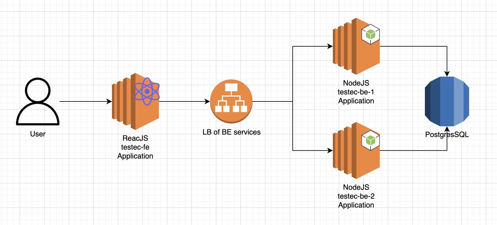

# AWS Deployment
## Deployment architecture

## Purpose
This path to introduce the process relating to AWS deployment.
This project will be deploy on aws with the following requirements

1. Using EC2 for the BE server
2. Using a load balancer to manage traffic of instance
3. Using AWS RDS

## How to deploy?
1. **FrontEnd application:** as the SPA is just a static web application so we can deploy it anywhere we want. Because I do not have a good ssl cert so I just deploy the SPA only on an EC2 with http protocol
2. **BackEnd on EC2s:** Using EC2 to checkout source code and run node on it as I do not have enough time to setup other WAS
3. **Load Balancer on AWS:** Using the AWS Load Balancer service to create a LB and attach the instances to that LB so the LB at BE side will be managed by this service. Only http protocol in this demo
4. **Database:** Using the PostgreSQL database on AWS RDS service to create a new DB server. In this project I enabled public access to this DB server to avoid spend too much time for infra configuration.

## System Setup in Detail
*I will not talk about how to do it on AWS*

### Postgres DB Server
1. Connect to server : After create it you open a terminal then connect to it. For the first time you should connect to the `postgres` database instance as there is no your own database instance for now.
Run this command line to connect to your DB server `psql -h <postgres public entry> -p <DB port> -d postgres`
2. After connected to your DB, run the commands in [SQL Scripts](https://github.com/paultran0920/testec-elearning-be/blob/master/scripts/pg.sql) to initialize data on the DB server. 
3. You are done now. Your DB server is ready.

### Run your Backend on the EC2s

1. Correct the pem file mode first, run `sudo chown 666 pem-file` (I am not sure 666 or 600 for now ^^, 666 work on my side)
2. From your PC, connect to server: Run this `ssh -i /path/key-pair-name.pem instance-user-name@instance-public-dns-name`
3. After connected to EC2, swith to root for next steps with `sudo -i`
4. Install NodeJS (16.x)/Git if not yet installed
5. Clone [Tectec BE](https://github.com/paultran0920/testec-elearning-be.git) by `git clone https://github.com/paultran0920/testec-elearning-be.git`
6. Correct the `.env` file as described here https://github.com/paultran0920/testec-elearning-be#pre-start
7. Run your BE application in background mode `nohup npm run start &`
8. Done let test your BE by trying to login with the public entry point of the load balancer

### Run the FrontEnd on EC2
1. Correct the pem file mode first, run `sudo chown 666 pem-file` (I am not sure 666 or 600 for now ^^, 666 work on my side)
2. From your PC, connect to server: Run this `ssh -i /path/key-pair-name.pem instance-user-name@instance-public-dns-name`
3. After connected to EC2, swith to root for next steps with `sudo -i`
4. Install NodeJS (16.x)/Git if not yet installed
5. Clone [Tectec FE](https://github.com/paultran0920/testec-elearning-fe) by `git clone https://github.com/paultran0920/testec-elearning-fe.git`
6. Correct the `.env` and build your application then deploy to a web server.

## More document can be found at

- FrontEnd: https://github.com/paultran0920/testec-elearning-fe
- BackEnd: https://github.com/paultran0920/testec-elearning-be

## DEMO
